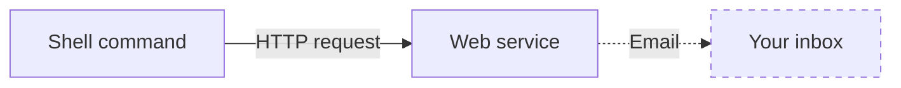

# curl-to-email

`curl-to-email` is a tool you can use to send yourself an email from the terminal (without it going to spam).

The tool is made of two parts:

1. A **shell command** that sends an HTTP request to a web service
2. A **web service** that sends an email when it receives that HTTP request



Here is how those two parts are implemented in this repo:

- The web service is implemented as a [Google Apps Script](https://www.google.com/script/start/) deployed as a web app
- The shell command is implemented as a [shell function](https://github.com/rothgar/mastering-zsh/blob/master/docs/helpers/functions.md) that uses `curl` under the hood

I use the tool to have my computer send me an email once it finishes doing something that takes a long time, such as dumping a database.

## Installation

Here's how you can install the tool:

### Prerequisites

- The current shell is `zsh`
    - To check: Run [`ps -p $$`](https://askubuntu.com/a/590903) and confirm the output contains "`zsh`"
- `git` is installed
    - To check: Run `git --version` and confirm the output contains a version number
- `curl` is installed
    - To check: Run `curl --version` and confirm the output contains a version number
- You have a [Google Account](https://support.google.com/accounts/answer/27441?hl=en) (free)

### Procedure

#### 1. Deploy the web service to Google Apps Script.

1. Visit https://script.google.com/home/projects/create to create a new Google Apps Script project.
1. In the Google Apps Script editor that appears, rename the project to "`curl-to-email`".
    - You can do that by clicking on "Untitled project" at the top of the page.
1. In the Google Apps Script editor, create a new script file named "`Config`".
    - In the "Files" section in the sidebar, click the `+` icon and select `Script`.
    - Enter the file's name as "`Config`" (without a suffix). Google Apps Script will automatically append a `.gs` to its name.
1. In this repository, copy the contents of `web-service/Code.gs` and paste it into the `Code.gs` file in the Google Apps Script editor, replacing its original contents.
1. Similarly, in this repository, copy the contents of `web-service/Config.gs` and paste it into the `Config.gs` file in the Google Apps Script editor, replacing its original contents.
1. Generate a password (e.g. using [this tool](https://bitwarden.com/password-generator/)) and copy it to your clipboard
1. In the `Config.gs` file, update the `SHARED_SECRET` value to be that password. For example:
   ```diff
   - SHARED_SECRET: "__REPLACE_ME__",
   + SHARED_SECRET: "dXfENeiLEh7RHQ",
   ```
1. Click the disk icon to save the project.
1. In the Google Apps Script editor, click `Deploy` > `New deployment`.
    - The "New deployment" window will appear.
1. In the "Select type" section, click the gear (cog) icon and select `Web app`.
    - A form will appear in the "Configuration" section of the window.
1. Fill in the form like this:
    1. Description: `v1.0.0`
    1. Execute as: `Me (...)`
    1. Who has access: `Anyone`
1. Click the `Deploy` button.
    - A message will appear that says:
      > The Web app requires you to authorize access to your data.
1. Click the "Authorize access" button. In the "Sign in - Google Accounts" window that appears, select your Google account. At the step that says "`curl-to-email` wants to access your Google Account", click the `Allow` button.
1. In the "Deployment successfully updated" window, click the `Done` button.

At this point, the web service has been deployed and is listening for HTTP requests.

#### 2. Add the `curl_to_email` command to your shell.

1. Clone this repository into your home folder.
    ```shell
    cd ~
    git clone https://github.com/eecavanna/curl-to-email.git
    ```
    > You can clone it into a different folder, provided you edit `zshrc_snippet.sh.txt` accordingly.
1. Install the command into your shell.
    ```shell
    cp  ~/.zshrc ~/.zshrc.bak
    cat ~/curl-to-email/shell-command/zshrc_snippet.sh.txt >> ~/.zshrc
    ```
    > The first command (optional) backs up your `.zshrc` file. The second command (required) appends the contents of `zshrc_snippet.sh.txt` to your `.zshrc` file.
1. Edit two lines in the file, `define_curl_to_email.sh`.
    ```shell
    vi ~/curl-to-email/shell-command/define_curl_to_email.sh
    ```
    The two lines are:
    ```sh
    CURL_TO_EMAIL_WEB_APP_URL='__REPLACE_ME__'
    ```
    - Replace `__REPLACE_ME__` with the "Web app" URL shown on Google Apps Script, under `Deploy` > `Manage Deployments` > _(the active deployment)_.
    ```sh
    CURL_TO_EMAIL_SHARED_SECRET='__REPLACE_ME__'
    ```
    - Replace `__REPLACE_ME__` with the same value you put into the `SHARED_SECRET` variable in the `Config.gs` file on Google Apps Script.
    > These changes will make it so the `curl_to_email` command can use the web service.
1. Re-initialize your current shell.
    ```shell
    source ~/.zshrc
    ```
    > That'll make it so your current shell has the `curl_to_email` command. Future shells will have it automatically.
1. Issue the `curl_to_email` command and check your email.
    ```shell
    curl_to_email "This is a test"
    ```
    > Within a few seconds, you will receive an email containing the message, "This is a test".

At this point, the entire tool—both the web service and the shell command—is fully set up.

#### 3. (Optional) Clean up.

1. Close the Google Apps Script editor (close the web page)
1. Close the terminal window (exit the shell)

## Usage

Here are some usage examples:

- Send an email (immediately).
  ```shell
  curl_to_email "Hello world!"
  ```
- Run a Python script, then send an email when it stops running.
  ```shell
  python ./script.py --option 123 ; curl_to_email "Script is done."
  ```
- Run an arbitrary program (e.g. `ping`), then send an email when it stops running.
  ```shell
  ping -c 10 www.example.com ; curl_to_email "Ping is done."
  ```
- Send an email when an already-running program stops running. This situation might arise if you started the program before you set up `curl-to-email`.
  ```shell
  # Get the process ID (e.g. "12345") of the already-running program.
  ps
  
  # When that process stops running, send an email.
  #
  # Explanation: `lsof -p 12345 +r` will repeatedly list information about the
  #              process having the process ID "12345" until that process stops
  #              running, and `1 &> /dev/null` will hide that information from
  #              the terminal. Once that process stops running, the next
  #              command (after the semicolon) will run, sending the email.
  #              
  lsof -p 22222 +r 1 &> /dev/null ; curl_to_email "That process is done."
  ```

## Uninstallation

Here's how you can uninstall the tool:

1. On Google Apps Script, remove the project.
1. In your `~/.zshrc` file, remove the lines that match the contents of `shell-command/zshrc_snippet.sh.txt`.
1. (Optional) Delete the clone of this repository (which includes this `README.md` file—goodbye!).

## Appendix

#### Usage with Python

Here's how you can use this tool from _within_ a Python script.

```py
import requests


CURL_TO_EMAIL_WEB_APP_URL = "..."
CURL_TO_EMAIL_SHARED_SECRET = "..."

payload = dict(secret=CURL_TO_EMAIL_SHARED_SECRET,
               message="This is a message.")

requests.post(CURL_TO_EMAIL_WEB_APP_URL, json=payload)
```

> This approach uses only the **web service** part of `curl-to-email`. It does not use the shell command part.
