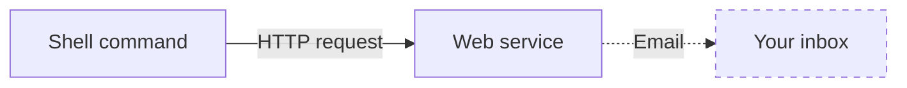

# curl-to-email

`curl-to-email` is a tool you can use to send yourself an email from the command-line.

The tool is made of two parts:

1. A **shell command** that sends an HTTP request to a web service
2. A **web service** that sends an email when it receives that HTTP request



Here is how those two parts are implemented in this repo:

- The web service is implemented as a [Google Apps Script](https://www.google.com/script/start/) deployed as a web app
- The shell command is implemented as a [shell function](https://github.com/rothgar/mastering-zsh/blob/master/docs/helpers/functions.md) that uses `curl` under the hood

I use the tool to have my computer send me an email once it finishes doing something that takes a long time, such as dumping a database.

## Installation

Here's how you can install the tool:

### Prerequisites

- The current shell is `zsh`
    - To check: Run [`ps -p $$`](https://askubuntu.com/a/590903) and confirm the output contains "`zsh`"
- `git` is installed
    - To check: Run `git --version` and confirm the output contains a version number
- `curl` is installed
    - To check: Run `curl --version` and confirm the output contains a version number

### Procedure

#### 1. Deploy the web service to Google Apps Script.

1. Visit https://script.google.com/home/projects/create to create a new Google Apps Script project
1. In the Google Apps Script editor that appears, rename the project to "`curl-to-email`"
    - You can do that by clicking on "Untitled project" at the top of the page
1. In the Google Apps Script editor, add a new file of type "Script" and enter its name as "`Config`"
    - Google Apps Script will automatically append a `.gs` to its name
1. Replace the contents of the `Code.gs` file with the contents of the `web-service/Code.gs` file in this repository
1. Replace the contents of the `Config.gs` file with the contents of the `web-service/Config.gs` file in this repository
1. In the `Config.gs` file, update the `SHARED_SECRET` variable so it contains a password you generate
    - I recommend generating the password using https://bitwarden.com/password-generator/
1. In the Google Apps Script editor, click "Deploy" > "New deployment"
1. In the "Select type" section, click the gear icon and select "Web app"
1. In the "Description" section, populate the fields like this:
    1. Description: `v1.0.0`
    1. Execute as: `Me (...)`
    1. Who has access: `Anyone` (you'll rely on the password you created earlier—instead of on Google—to restrict access)
1. Click the disk icon to save the project
1. Click the "Deploy" button
1. Allow the Google Apps Script project to send email as you:
    1. Click the "Authorize access" button
    1. In the "Sign in - Google Accounts" window that appears, select your Google account
    1. In the "`curl-to-email` wants to access your Google Account" window, click the "Allow" button
1. In the "Deployment successfully updated" window, click the "Done" button

At this point, the web service is listening for HTTP requests.

#### 2. Add the `curl_to_email` command to your shell.

1. Clone this repository into your home folder.
    ```shell
    cd ~
    git clone https://github.com/eecavanna/curl-to-email.git
    ```
    > You can clone it into a different folder, provided you edit `zshrc_snippet.sh.txt` accordingly.
1. Install the command into your shell.
    ```shell
    cp  ~/.zshrc ~/.zshrc.bak
    cat ~/curl-to-email/shell-command/zshrc_snippet.sh.txt >> ~/.zshrc
    ```
    > The first command (optional) backs up your `.zshrc` file. The second command (required) appends the contents of `zshrc_snippet.sh.txt` to your `.zshrc` file.
1. Edit two lines in the file, `define_curl_to_email.sh`.
    ```shell
    vi ~/curl-to-email/shell-command/define_curl_to_email.sh
    ```
    The two lines are:
    ```sh
    CURL_TO_EMAIL_WEB_APP_URI='__REPLACE_ME__'
    CURL_TO_EMAIL_SHARED_SECRET='__REPLACE_ME__'
    ```
    Edit them as follows:
    - Set `CURL_TO_EMAIL_WEB_APP_URI` to the "Web app" URL shown on Google Apps Script, under "Deploy" > "Manage Deployments" > (Active deployment).
    - Set `CURL_TO_EMAIL_SHARED_SECRET` to the `SHARED_SECRET` value you put in `Config.gs` on Google Apps Script.
    > These changes will make it so the `curl_to_email` command can talk to the web service.
1. Re-initialize your current shell.
    ```shell
    source ~/.zshrc
    ```
    > That'll make it so your current shell has the `curl_to_email` command. Future shells will have it automatically.
1. Issue the `curl_to_email` command and check your email.
    ```shell
    curl_to_email "This is a test"
    ```
    > Within a few seconds, you will receive an email containing the message, "This is a test".

At this point, the entire tool—both the web service and the shell command—is fully set up.

#### 3. (Optional) Clean up.

1. Close the Google Apps Script editor (close the web page)
1. Close the terminal window (exit the shell)

### Usage

TODO

### Uninstallation

Here's how you can uninstall the tool:

1. On Google Apps Script, delete the project.
1. In your `~/.zshrc` file, remove the lines that match the contents of `shell-command/zshrc_snippet.sh.txt`.
1. (Optional) Delete the clone of this repository (which includes this `README.md` file—goodbye!).
